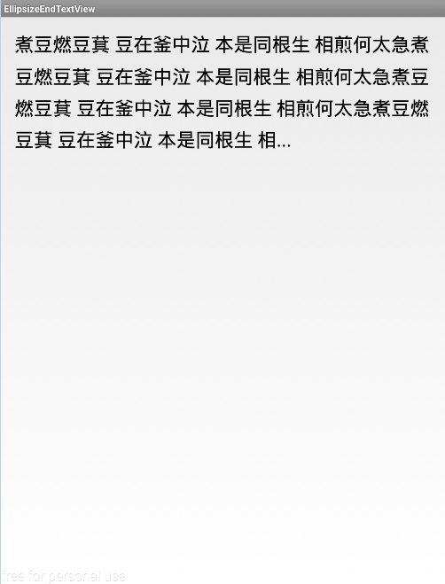
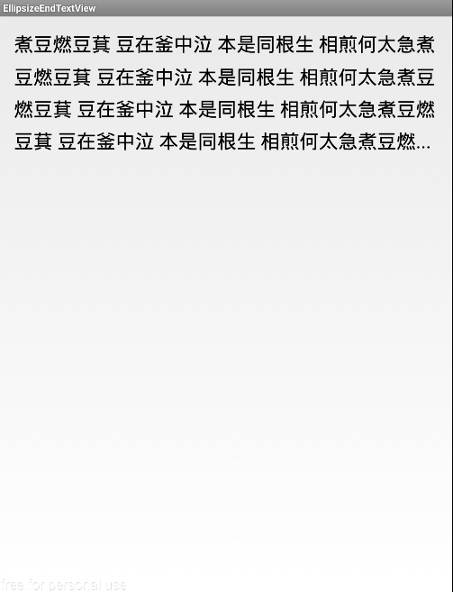

EllipsizeEndTextView
==========================

This project provides a Android Textview-like control which allows you to set max number
of lines to wrap an input string, then ellipsizes the last line if there's not
enough room to handle the entire input string. also you can set the last line scale.

## How to use?

in layout file, define it:

```xml
<com.cs.ellipsizetextview.ui.EllipsizeEndTextView
     android:layout_width="wrap_content"
     android:layout_height="wrap_content"
     android:lineSpacingMultiplier="1.4"
     android:lines="4"
     android:padding="20dp"
     android:text="@string/ellipsize_text"
     android:textColor="@android:color/black"
     android:textSize="28sp"
     app:lastlscale="0.70" />

```

 - app:lastlscale="0.70" 
    
 -  app:lastlscale="1" 
 

License
=======

```
Copyright 2013 Vince Styling

Licensed under the Apache License, Version 2.0 (the "License");
you may not use this file except in compliance with the License.
You may obtain a copy of the License at

http://www.apache.org/licenses/LICENSE-2.0

Unless required by applicable law or agreed to in writing, software
distributed under the License is distributed on an "AS IS" BASIS,
WITHOUT WARRANTIES OR CONDITIONS OF ANY KIND, either express or implied.
See the License for the specific language governing permissions and
limitations under the License.
```
